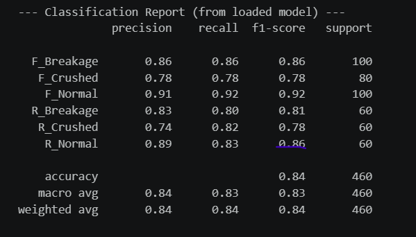
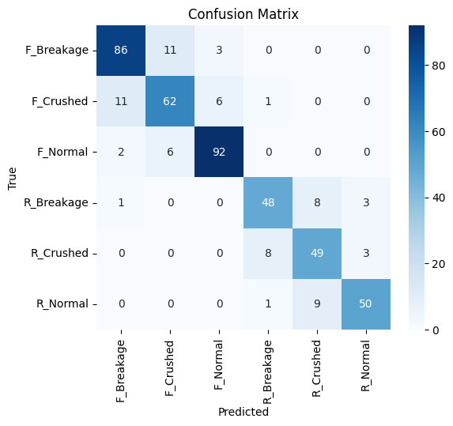
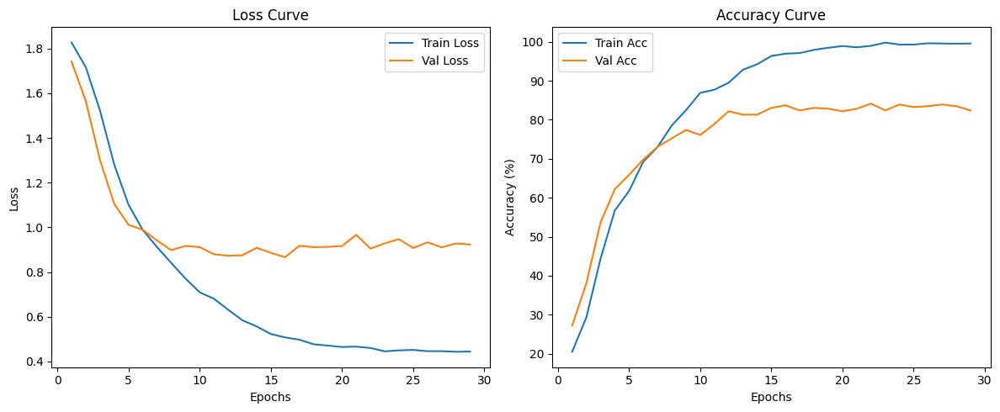
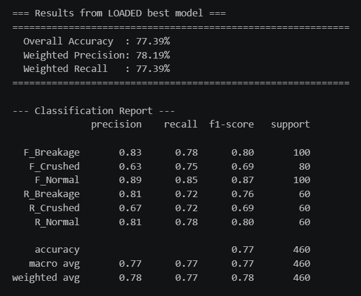
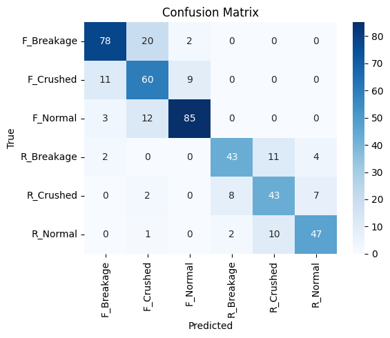
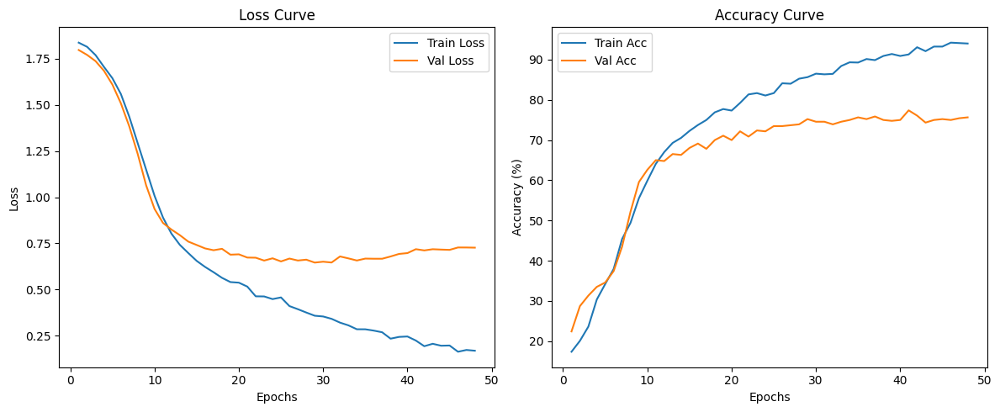
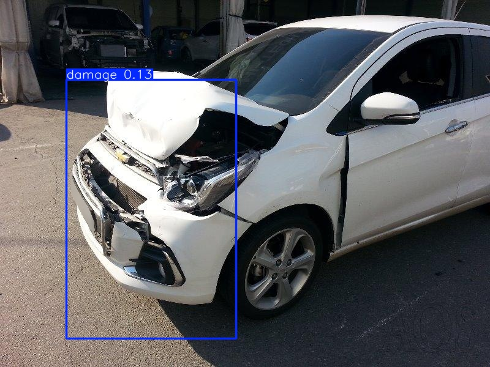
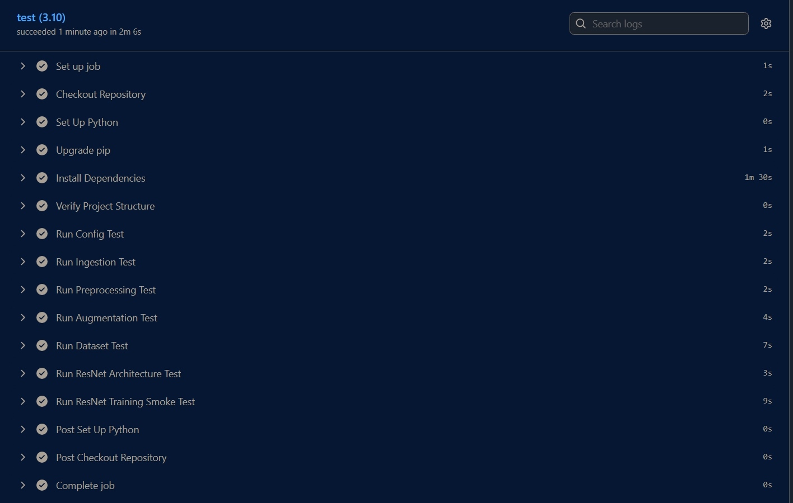

# 🚗 DamageLens: AI-Powered Car Damage Detection

[](https://python.org)
[](https://pytorch.org)
[](https://fastapi.tiangolo.com)
[](https://github.com/junaidariie/DamageLensAI/actions/workflows/ci.yaml)
[](LICENSE)

---

## ⚠️ Important Notes

> **Cold Startup Time**: The API may take **4-5 minutes** on the first request to warm up the models. Subsequent predictions will be significantly faster.

> **Model Size**: The Fusion model is computationally intensive. Individual predictions typically complete in 30-60 seconds depending on hardware.

---

**APP LINK** : https://junaidariie.github.io/DamageLensAI/

**HF REPO** : https://huggingface.co/spaces/junaid17/DamageLensAI/tree/main

---

## 📋 Table of Contents

- [Overview](#-overview)
- [Features](#-features)
- [Architecture](#-architecture)
- [Model Performance](#-model-performance)
- [CI Pipeline](#-ci-pipeline)
- [Setup & Installation](#-setup--installation)
- [Usage](#-usage)
- [API Documentation](#-api-documentation)
- [Model Optimization](#-model-optimization)
- [Dataset & Training](#-dataset--training)
- [Web UI Features](#-web-ui-features)
- [Directory Structure](#-directory-structure)
- [Limitations & Known Issues](#-limitations--known-issues)

---

## 🎯 Overview

**DamageLens** is an advanced AI system for detecting and classifying car damage using multi-model fusion architecture. It combines the power of **ResNet-18**, **EfficientNet-V2-S**, and **ConvNeXt-Small** to achieve robust damage classification across vehicle front and rear sections.

The system can identify six damage categories:
- ✅ Front Normal / Front Breakage / Front Crushed
- ✅ Rear Normal / Rear Breakage / Rear Crushed

Additionally, it uses **YOLO object detection** to localize damage regions with bounding boxes.

---

## ✨ Features

| Feature | Description |
|---------|-------------|
| **Dual Model Architecture** | ResNet (lightweight) and Fusion (high-accuracy) options |
| **Grad-CAM Visualization** | Understand which image regions drive predictions |
| **Real-time YOLO Detection** | Localize damage with confidence scores |
| **FP16 Optimization** | Reduced model size (788MB → 135MB) with minimal accuracy loss |
| **FastAPI Backend** | High-performance REST API with async support |
| **Responsive Web UI** | Modern, interactive web interface with real-time feedback |
| **Static File Serving** | Efficient caching and delivery of results |
| **CI/CD Pipeline** | Automated testing via GitHub Actions on every push/PR |
| **HuggingFace Integration** | Models auto-downloaded from HF Hub on first startup |

---

## 🏗️ Architecture

### System Overview

```
┌──────────────────────────────────────────────────────┐
│                   Frontend (Web UI)                  │
│  HTML / CSS / JavaScript  (Dark Mode, Glassmorphism) │
│  ├─ Drag & Drop Image Upload                         │
│  ├─ Model Selection (Fusion / ResNet)                │
│  └─ Real-time Result Tabs (Prediction/GradCAM/YOLO)  │
└───────────────────┬──────────────────────────────────┘
                    │ REST API (JSON)
┌───────────────────▼──────────────────────────────────┐
│              FastAPI Backend  (app.py)               │
│  ├─ POST /predict/resnet    → ResNet inference       │
│  ├─ POST /predict/fusion    → Fusion inference       │
│  ├─ POST /predict?mode=*    → Grad-CAM generation    │
│  └─ POST /predict/yolo      → YOLO detection         │
│                                                      │
│  Lifespan: models loaded once at startup             │
│  Static:   /static/uploads  /static/results          │
└──────┬───────────┬──────────────┬────────────────────┘
       │           │              │
┌──────▼──┐  ┌─────▼──────┐  ┌───▼──────────┐
│ ResNet  │  │   Fusion   │  │  YOLO v11m   │
│  (77%)  │  │   (84%)    │  │  Detection   │
└──────┬──┘  └─────┬──────┘  └───┬──────────┘
       │           │              │
       └─────┬─────┘              │
             │                    │
     ┌───────▼──────┐    ┌────────▼────────┐
     │  Grad-CAM    │    │  Bounding Boxes │
     │  Heatmaps    │    │  + Confidence   │
     └──────────────┘    └─────────────────┘
```

### Model Loading (scripts/load_models.py)

```
Startup
  │
  ├─ hf_hub_download("junaid17/car-damage-classifier")
  │       └─> ResnetCarDamagePredictor(checkpoint, class_map)
  │
  ├─ hf_hub_download("junaid17/best_fusion_model_fp16")
  │       └─> FusionCarDamagePredictor(checkpoint, class_map)
  │
  └─ hf_hub_download("junaid17/Yolo_Model")
          └─> YOLO(checkpoint)
```

### Fusion Model (High Accuracy — 84%)

```
┌─────────────────────────────────────────────────────────────────┐
│                          INPUT IMAGE                            │
│                         (3, 260, 260)                           │
└────────────────┬────────────────────────────────┬──────────────┘
                 │                                │
         ┌───────▼────────┐             ┌─────────▼────────┐
         │ EfficientNet-  │             │  ConvNeXt-Small  │
         │ V2-S Backbone  │             │  Backbone        │
         │                │             │                  │
         │ Frozen except  │             │ Frozen except    │
         │ features[5,6,7]│             │ stages[2,3] +    │
         │ (unfrozen)     │             │ layernorm        │
         └───────┬────────┘             └─────────┬────────┘
                 │                                │
         ┌───────▼────────┐             ┌─────────▼────────┐
         │ AdaptiveAvg    │             │  Pooler Output   │
         │ Pool → Flatten │             │                  │
         └───────┬────────┘             └─────────┬────────┘
                 │  (1280,)                        │  (768,)
                 └──────────────┬─────────────────┘
                                │
                        ┌───────▼────────┐
                        │  CONCATENATE   │
                        │  1280 + 768    │
                        │  = (2048,)     │
                        └───────┬────────┘
                                │
                    ┌───────────▼───────────┐
                    │   FUSION HEAD         │
                    │  Dropout(0.4)         │
                    │  Linear(2048 → 512)   │
                    │  LayerNorm(512)       │
                    │  GELU()               │
                    │  Dropout(0.3)         │
                    │  Linear(512 → 256)    │
                    │  LayerNorm(256)       │
                    │  GELU()               │
                    │  Dropout(0.2)         │
                    │  Linear(256 → 6)      │
                    └───────────┬───────────┘
                                │
                        ┌───────▼────────┐
                        │ OUTPUT LOGITS  │
                        │  (6 classes)   │
                        └────────────────┘
```

**Optimizer**: AdamW with per-group learning rates
- EfficientNet features[5]: lr=1e-5
- EfficientNet features[6,7]: lr=3e-5
- ConvNeXt stages[2,3] + layernorm: lr=3e-5
- Fusion head: lr=1e-4
- Loss: CrossEntropyLoss with label_smoothing=0.1
- Early stopping patience: 7

### ResNet-18 (Lightweight — 77%)

```
┌──────────────────────────────────┐
│      INPUT IMAGE                 │
│     (3, 128, 128)                │
└───────────────┬──────────────────┘
                │
        ┌───────▼─────────┐
        │   ResNet-18     │
        │   Backbone      │
        │                 │
        │  Frozen except  │
        │  layer3, layer4 │
        └───────┬─────────┘
                │  (512,)
        ┌───────▼─────────────────────┐
        │  Classification Head        │
        │  Dropout(0.5)               │
        │  Linear(512 → 256)          │
        │  ReLU()                     │
        │  Dropout(0.3)               │
        │  Linear(256 → 6 classes)    │
        └───────┬─────────────────────┘
                │
        ┌───────▼──────────┐
        │  OUTPUT LOGITS   │
        │  (6 classes)     │
        └──────────────────┘
```

**Optimizer**: AdamW with per-group learning rates
- layer3: lr=1e-5
- layer4: lr=1e-5
- fc head: lr=1e-4
- Loss: CrossEntropyLoss
- Early stopping patience: 7

### YOLO v11m Integration

```
┌─────────────────────────────┐
│   INPUT IMAGE               │
│   imgsz=640, conf=0.05      │
└──────────────┬──────────────┘
               │
       ┌───────▼────────┐
       │  YOLO v11m     │
       │  Inference     │
       └───────┬────────┘
               │
    ┌──────────┴──────────┐
    │                     │
┌───▼───────┐      ┌──────▼──────┐
│ Bboxes    │      │ Confidence  │
│ (x1,y1,   │      │ Scores +    │
│  x2,y2)   │      │ Class Label │
└───┬───────┘      └──────┬──────┘
    └──────────┬──────────┘
               │
       ┌───────▼────────┐
       │ result.plot()  │
       │ Save to disk   │
       └────────────────┘
```

### Grad-CAM Pipeline (scripts/gradcam.py)

```
Image Path
    │
    ├─ ResNet mode:  target_layer = model.layer4[-1]
    └─ Fusion mode:  target_layer = model.eff_features[-1]
                     (FP16 → FP32 cast on CPU automatically)
    │
    ├─ Register forward hook  (_GradCAMHook)
    ├─ Forward pass → score.backward()
    ├─ acts [C,H,W]  ×  weights (mean of grads) → CAM [H,W]
    ├─ ReLU → normalize → resize to original dims
    └─ cv2.applyColorMap(COLORMAP_JET) → addWeighted overlay
```

### Data Pipeline (src/data/)

```
Raw Images (data/dataset/)
    │
    ├─ ingestion.py   → scan folders, build file list
    ├─ preprocessing.py → validate / clean images
    ├─ augmentation.py  → train/val transforms
    │     ResNet:  Resize(128,128) + HFlip + Rotation(15°) + ColorJitter
    │     Fusion:  Resize(260,260) + HFlip + Rotation(10°) + ColorJitter
    └─ dataset.py   → ImageFolder DataLoaders
                       (train 80% / val 20%, seed=42)
```

### Export & Deployment (src/export/)

```
Trained Checkpoints (checkpoints/)
    │
    ├─ conver_model.py         → FP32 → FP16 conversion
    │                            788MB → 135MB (82.9% reduction)
    └─ upload_to_huggingface.py → HfApi upload to:
          junaid17/new-damagelens-resnet-classifier
          junaid17/new-damagelens-fusion-fp16
          junaid17/new-damagelens-yolo-detector
```

---

## 📊 Model Performance

### Fusion Model (High Accuracy — 84% Overall)

**Classification Report:**



**Confusion Matrix:**



**Training Curves:**



---

### ResNet-18 (Lightweight — 77% Overall)

**Classification Report:**



**Confusion Matrix:**



**Training Curves:**



---

### YOLO Detection Results



---

## 🔁 CI Pipeline

DamageLens uses **GitHub Actions** for continuous integration. Every push or pull request to `main`, `master`, or `dev` triggers the full test suite automatically.

**CI Screenshot (GitHub Actions — All Tests Passing):**



### What the pipeline tests:

| Step | Test File | What it covers |
|------|-----------|----------------|
| Config | `test_config.py` | Paths, constants, class map |
| Ingestion | `test_ingestion.py` | Dataset folder scanning |
| Preprocessing | `test_preprocessing.py` | Image validation & cleaning |
| Augmentation | `test_augmentation.py` | Transform pipelines |
| Dataset | `test_dataset.py` | DataLoader creation |
| ResNet Architecture | `test_resnet_model.py` | Model init & forward pass |
| ResNet Training | `test_train_resnet.py` | Smoke test training loop |

### Pipeline config (`.github/workflows/ci.yaml`):
- Runs on: `ubuntu-latest`
- Python: `3.10`
- Triggers: push & PR to `main` / `master` / `dev`

---

## 🚀 Setup & Installation

### Prerequisites

- Python 3.11+
- CUDA 11.8+ (for GPU acceleration, optional but recommended)
- 8GB+ RAM (16GB recommended for Fusion model)

### Installation Steps

```bash
# Clone the repository
git clone https://github.com/junaid17/damagelens.git
cd DamageLens

# Create virtual environment
python -m venv myvenv
source myvenv/bin/activate  # On Windows: myvenv\Scripts\activate

# Install dependencies
pip install -r requirements.txt

# Create required directories
mkdir -p static/uploads static/results checkpoints assets
```

### Download Pre-trained Models

Models are automatically downloaded from Hugging Face on first use:
- `car-damage-classifier.pt` — ResNet-18 checkpoint
- `best_fusion_model_fp16.pt` — Fusion model (FP16 optimized, 135MB)
- `damage_detector.pt` — YOLO v11m model

---

## 💻 Usage

### Running the FastAPI Server

```bash
uvicorn app:app --reload --host 127.0.0.1 --port 8000
```

Open your browser at `http://127.0.0.1:8000`

#### Quick Start:
1. Upload a car image (JPG/PNG)
2. Select analysis mode: **Fusion** (accurate) or **ResNet** (fast)
3. Click "Run AI Analysis"
4. View results in tabs:
   - 📊 **Prediction**: Confidence scores and probabilities
   - 👀 **Grad-CAM**: Visualize which regions influenced the prediction
   - 🎯 **YOLO**: Damage bounding boxes with confidence

### Python API Example

```python
import requests

with open('car_image.jpg', 'rb') as f:
    files = {'image': f}
    resp = requests.post('http://127.0.0.1:8000/predict/resnet', files=files)
    print(resp.json())

with open('car_image.jpg', 'rb') as f:
    files = {'image': f}
    resp = requests.post('http://127.0.0.1:8000/predict/fusion', files=files)
    print(resp.json())
```

---

## 📡 API Documentation

### `POST /predict/resnet`
```
Content-Type: multipart/form-data
Body: image (File)

Response:
{
  "status": "success",
  "prediction": {
    "Rear Normal": 0.47,
    "Front Normal": 0.25,
    ...
  }
}
```

### `POST /predict/fusion`
```
Content-Type: multipart/form-data
Body: image (File)

Response:
{
  "status": "success",
  "prediction": {
    "Rear Normal": 0.49,
    "Front Normal": 0.35,
    ...
  }
}
```

### `POST /predict?mode={resnet|fusion}` — Grad-CAM
```
Content-Type: multipart/form-data
Body: file (File), mode (String)

Response:
{
  "status": "success",
  "mode": "fusion",
  "original_image": "/static/uploads/{uuid}_input.jpg",
  "selected_viz": "/static/results/{uuid}_fusion.jpg",
  "resnet_viz": null,
  "fusion_viz": "/static/results/{uuid}_fusion.jpg"
}
```

### `POST /predict/yolo`
```
Content-Type: multipart/form-data
Body: file (File)

Response:
{
  "status": "success",
  "original_image": "/static/uploads/{uuid}_input.jpg",
  "yolo_image": "/static/results/{uuid}_yolo.jpg",
  "detections": [
    { "label": "damage", "confidence": 0.87, "box": [x1, y1, x2, y2] }
  ],
  "total_detections": 2,
  "message": "Detections found"
}
```

---

## 🔧 Model Optimization

### FP16 Conversion (Fusion Model)

```
Original Model (FP32):     788 MB
Optimized Model (FP16):    135 MB
───────────────────────────────────
Compression Ratio:         82.9% reduction ✅
Accuracy Loss:             < 1%            ⚠️
Speed Improvement:         ~1.3x faster   ⚡
```

The system auto-detects FP16 checkpoints at load time:

```python
if first_tensor.dtype == torch.float16:
    model = model.half()

# Grad-CAM on CPU: FP16 → FP32 cast applied automatically
if is_half:
    model = model.float()
```

---

## 📚 Dataset & Training

### Data Constraints

- **Total Samples**: ~1,800 images
- **Train/Val Split**: 80/20 (seed=42)
- **Classes**: 6 (F_Breakage, F_Crushed, F_Normal, R_Breakage, R_Crushed, R_Normal)
- **YOLO subset**: ~100 annotated images (train/val split)

### Data Augmentation

| Transform | ResNet | Fusion |
|-----------|--------|--------|
| Resize | 128×128 | 260×260 |
| RandomHorizontalFlip | ✅ | ✅ |
| RandomRotation | ±15° | ±10° |
| ColorJitter (b/c/s) | ±20% | ±15% |
| ImageNet Normalize | ✅ | ✅ |

### Training Configuration

| Setting | ResNet | Fusion |
|---------|--------|--------|
| Backbone | ResNet-18 | EfficientNet-V2-S + ConvNeXt-Small |
| Frozen layers | All except layer3, layer4 | All except features[5,6,7] / stages[2,3] |
| Optimizer | AdamW | AdamW (per-group LR) |
| Loss | CrossEntropyLoss | CrossEntropyLoss (label_smoothing=0.1) |
| Early stopping | patience=7 | patience=7 |
| Input size | 128×128 | 260×260 (EfficientNet) / 224×224 (ConvNeXt) |

---

## 🎨 Web UI Features

- Dark mode glassmorphism design
- Drag & drop image upload
- Model selection dropdown (Fusion / ResNet)
- Real-time confidence bar animation
- Tab navigation: Prediction → Grad-CAM → YOLO
- Scan line effect during processing
- Plotly bar chart for class probabilities
- Side-by-side original vs heatmap comparison

---

## 🔍 Grad-CAM Visualization

Gradient-weighted Class Activation Mapping highlights which image regions most influenced the model's prediction.

```
Original Image    +    Grad-CAM Heatmap    =    Overlay
                       Red   = High importance
                       Blue  = Low importance
```

- ResNet: hooks into `layer4[-1]`
- Fusion: hooks into `eff_features[-1]` (EfficientNet's last block)

---

## 📋 Directory Structure

```
DamageLens/
├── app.py                              # FastAPI app + all endpoints
├── index.html                          # Web UI
├── requirements.txt
├── README.md
│
├── .github/
│   └── workflows/
│       └── ci.yaml                     # GitHub Actions CI pipeline
│
├── assets/                             # ← Place README images here
│   ├── fusion_classification_report.png
│   ├── fusion_confusion_matrix.png
│   ├── fusion_training_curves.png
│   ├── resnet_classification_report.png
│   ├── resnet_confusion_matrix.png
│   ├── resnet_training_curves.png
│   ├── yolo_detection_sample.png
│   └── ci_pipeline_passing.png
│
├── scripts/
│   ├── prediction_helper.py            # ResNet + Fusion model classes & inference
│   ├── gradcam.py                      # Grad-CAM (ResNet + Fusion, CPU-optimized)
│   ├── load_models.py                  # HF Hub download + model initialization
│   └── yolo_predict.py                 # YOLO inference + bbox drawing
│
├── src/
│   ├── config.py                       # Paths, hyperparams, class map
│   ├── data/
│   │   ├── ingestion.py                # Dataset folder scanning
│   │   ├── preprocessing.py            # Image validation
│   │   ├── augmentation.py             # Train/val transforms
│   │   └── dataset.py                  # DataLoader creation
│   ├── models/
│   │   ├── resnet_model.py             # CarClassifierResNet
│   │   └── fusion_model.py             # FusionClassifier
│   ├── training/
│   │   ├── trainer.py                  # Generic train loop (single + dual input)
│   │   ├── train_resnet.py             # ResNet training entry point
│   │   ├── train_fusion.py             # Fusion training entry point
│   │   └── train_yolo.py               # YOLO fine-tuning
│   └── export/
│       ├── conver_model.py             # FP32 → FP16 conversion
│       └── upload_to_huggingface.py    # HF Hub upload script
│
├── checkpoints/
│   ├── best_resnet_model.pt
│   ├── best_fusion_model_fp16.pt
│   ├── damage_detector.pt
│   └── yolo11m.pt
│
├── Notebooks/
│   ├── Resnet18_fine_tuning_final.ipynb
│   ├── EfficientNet_ConvNext_Fusion.ipynb
│   └── damage_detector_yolo.ipynb
│
├── test/
│   ├── test_config.py
│   ├── test_ingestion.py
│   ├── test_preprocessing.py
│   ├── test_augmentation.py
│   ├── test_dataset.py
│   ├── test_resnet_model.py
│   ├── test_fusion_model.py
│   ├── test_train_resnet.py
│   ├── test_train_fusion.py
│   ├── test_train_yolo.py
│   ├── test_model_conversion.py
│   └── test_upload_to_huggingface.py
│
├── data/
│   ├── dataset/                        # 6-class image folders
│   │   ├── F_Breakage/
│   │   ├── F_Crushed/
│   │   ├── F_Normal/
│   │   ├── R_Breakage/
│   │   ├── R_Crushed/
│   │   └── R_Normal/
│   └── yolo/                           # YOLO annotated subset
│       ├── train/images + labels/
│       ├── val/images + labels/
│       └── dataset_custom.yaml
│
└── static/
    ├── uploads/                        # Temp uploaded images
    └── results/                        # Generated Grad-CAM / YOLO outputs
```

---

## ⚠️ Limitations & Known Issues

### Data Constraints
- **Limited Training Data**: ~1,800 samples — may show variance on edge cases
- **Class Imbalance**: Rear Crushed class has fewer samples, affecting recall

### Performance

| Metric | Value | Note |
|--------|-------|------|
| ResNet Inference | ~500ms | Fast, lower accuracy |
| Fusion Inference | 30-60s | Accurate, computationally heavy |
| Cold Startup | 4-5 min | HF Hub download + model warmup |
| GPU Memory | ~4GB | For Fusion model |
| ResNet Accuracy | 77% | Lightweight trade-off |
| Fusion Accuracy | 84% | Best accuracy |

### Technical Limitations
- Fusion accuracy is **7% higher** than ResNet (84% vs 77%)
- YOLO model may miss small or partially occluded damage
- Grad-CAM is for diagnostic/explainability purposes only
- Batch processing not currently supported
- FP16 Grad-CAM on CPU requires automatic FP32 cast (handled internally)
